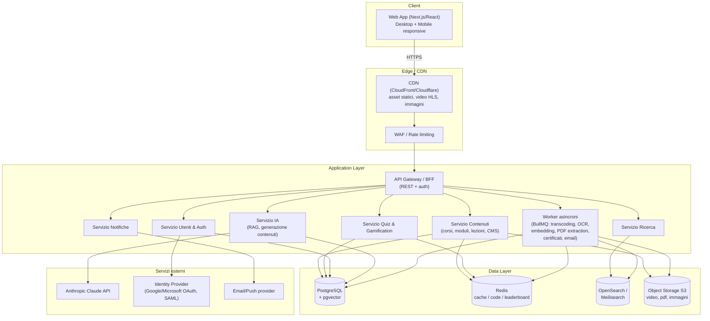

# 9. Architettura tecnica

## 9.1 Diagramma dell'architettura software

**Note architetturali:**
- Si parte con un **monolite modulare** (moduli NestJS ben separati per dominio: Contenuti, Quiz/Gamification, Utenti, IA, Ricerca, Notifiche) — più semplice da sviluppare/deployare per un MVP, ma con confini di dominio già puliti così da poter **estrarre singoli moduli come microservizi** in futuro senza riscrivere la logica di business (vedi cap. 16).
- I task lunghi (transcodifica video, OCR, estrazione PDF, embedding, generazione certificati, invio email) sono sempre **asincroni** su code dedicate, mai eseguiti nella request-response sincrona.

## 9.2 Stack tecnologico e motivazioni

### Frontend
**Next.js (React) + TypeScript + Tailwind CSS + shadcn/ui**
- Next.js: rendering ibrido (SSR/SSG per SEO su catalogo pubblico, CSR per aree autenticate), routing file-based, ottimizzazione immagini/video nativa.
- TypeScript: sicurezza dei tipi condivisa con il backend (contratti API), meno bug in produzione.
- Tailwind + shadcn/ui: velocità di sviluppo, design system consistente, componenti accessibili di base.
- State management: **React Query/TanStack Query** per dati server (cache, invalidazione) + **Zustand** per stato UI locale (leggero, senza boilerplate di Redux).
- Grafici: **Recharts** (dashboard utente/admin).

### Backend
**NestJS (Node.js + TypeScript)**
- Struttura modulare a domini con Dependency Injection nativa → adatta a un CMS complesso con molte entità correlate.
- Stesso linguaggio (TypeScript) di frontend → team unico full-stack, condivisione tipi/DTO.
- Ecosistema maturo per REST, validazione (class-validator), guardie di autorizzazione, code (integrazione BullMQ), WebSocket (notifiche real-time).
- Alternative valutate: Django (Python, ottimo per IA/ML ma meno naturale per team JS full-stack), Laravel (PHP, valido ma ecosistema IA più debole). NestJS scelto per l'equilibrio produttività/coerenza tecnologica full-stack + facilità di integrazione con SDK IA (Node).

### Database
**PostgreSQL** come database primario
- Relazionale, ACID, adatto alla struttura fortemente relazionale del dominio (corsi/moduli/lezioni/utenti/progressi).
- Estensione **pgvector** per gli embedding IA: evita di introdurre un database vettoriale separato nella fase iniziale, riducendo la complessità operativa (si valuta la migrazione a un vector DB dedicato — Pinecone/Qdrant — solo se il volume lo giustifica).
- JSONB per campi semi-strutturati (es. payload domande quiz) senza rinunciare a query relazionali.

### Cache, code, real-time
**Redis**
- Cache di sessione/risposte frequenti, code job (via BullMQ), Sorted Set per classifiche gamification, pub/sub per notifiche real-time.

### Ricerca
**OpenSearch** (o **Meilisearch** per setup più semplici/economici)
- Full-text search performante multi-entità con ranking, evidenziazione, tolleranza a errori di battitura — capacità che PostgreSQL full-text da solo offre in modo più limitato su grandi volumi.

### Cloud Storage
**Object storage S3-compatibile** (AWS S3 in produzione cloud, MinIO per on-premise/self-hosted)
- Standard de facto, costo per GB contenuto, integrazione nativa con CDN, upload diretto via presigned URL (riduce carico sul backend), versioning nativo utile per i manuali.

### Video
- Transcodifica **HLS multi-bitrate** (AWS MediaConvert o pipeline ffmpeg su worker dedicati) per adattività di banda.
- Distribuzione via **CDN** con signed URL/cookie per protezione contenuti a pagamento/riservati.

### Autenticazione
- **JWT (access token) + refresh token httpOnly cookie**, rotazione refresh token.
- **OAuth2/OIDC** per login social e soprattutto **SSO aziendale** (Google Workspace, Microsoft Entra ID) — requisito tipico in ambito formazione aziendale.
- **SAML 2.0** opzionale per integrazione con Identity Provider enterprise legacy.
- **MFA** (TOTP) opzionale/obbligabile per ruolo admin.
- Libreria: Passport.js (strategie multiple) integrato in NestJS.

### API
- **REST** come standard primario (semplicità, cache HTTP, ampia compatibilità), documentato con **OpenAPI/Swagger** generato automaticamente dai decoratori NestJS.
- Valutazione di **GraphQL** come layer opzionale per le dashboard con query aggregate complesse e composizione flessibile, se il REST risultasse limitante in fase avanzata (non necessario per l'MVP).
- **Webhook** in uscita per integrazioni esterne (es. HRIS aziendale, notifica completamento corso a sistemi terzi).

### Sicurezza
- HTTPS end-to-end, HSTS.
- OWASP Top 10: validazione input (class-validator/zod), protezione CSRF su cookie, sanitizzazione contenuti rich-text (evitare XSS su contenuti caricati da admin/formatori), rate limiting su API pubbliche e su login (anti brute-force), Content Security Policy.
- RBAC granulare (ruoli + permessi per risorsa/categoria), audit log delle azioni amministrative sensibili.
- Scansione antivirus su ogni file caricato prima della pubblicazione.
- Crittografia dati sensibili at-rest (colonne PII) e in transito.
- Penetration test periodico e dependency scanning automatico (Dependabot/Snyk) in CI.
- Conformità **GDPR**: consenso esplicito, diritto di accesso/cancellazione dati, data retention policy documentata.

### Backup e disaster recovery
- Backup automatico giornaliero di PostgreSQL (snapshot + WAL archiving per point-in-time recovery), retention configurabile (es. 30 giorni).
- Versioning/replica cross-region per l'object storage (video, PDF, certificati).
- Backup testati periodicamente con **restore drill** (un backup mai verificato non è un backup affidabile).
- Infrastruttura definita come codice (Terraform) per ricreare l'ambiente in caso di disastro totale.
- RPO target: ≤ 24h (MVP) → ≤ 1h (v1.0 con WAL streaming). RTO target: ≤ 4h.

### Infrastruttura e CI/CD
- **Docker** per tutti i servizi, **Kubernetes** (o AWS ECS Fargate per team più piccoli, meno overhead operativo) per orchestrazione e auto-scaling.
- **GitHub Actions**: build, test, lint, scan sicurezza, deploy automatico (staging su ogni merge, produzione su tag/release).
- **Monitoring**: Prometheus + Grafana (metriche), Sentry (error tracking frontend/backend), Loki/ELK (log centralizzati).
- Ambienti separati: dev → staging → produzione, con feature flag (es. Unleash/LaunchDarkly) per rilasci progressivi.

## 9.3 Sintesi tabellare

| Livello | Tecnologia | Motivazione principale |
|---|---|---|
| Frontend | Next.js + TS + Tailwind | DX elevata, SSR/SEO, componenti accessibili |
| Backend | NestJS (Node/TS) | modularità a domini, DI, stesso linguaggio del FE |
| DB primario | PostgreSQL + pgvector | relazionale robusto + vettoriale integrato |
| Cache/code | Redis + BullMQ | performance, job asincroni, leaderboard |
| Ricerca | OpenSearch/Meilisearch | full-text avanzato multi-entità |
| Storage | S3 / MinIO | standard, costo, CDN-friendly |
| Video | HLS + CDN | adattività banda, protezione contenuti |
| Auth | JWT + OAuth2/SAML + MFA | SSO aziendale, sicurezza |
| IA | Anthropic Claude API + pgvector (RAG) | qualità risposte, controllo contesto |
| Infra | Docker + K8s/ECS + GitHub Actions | scalabilità, deploy ripetibile |
