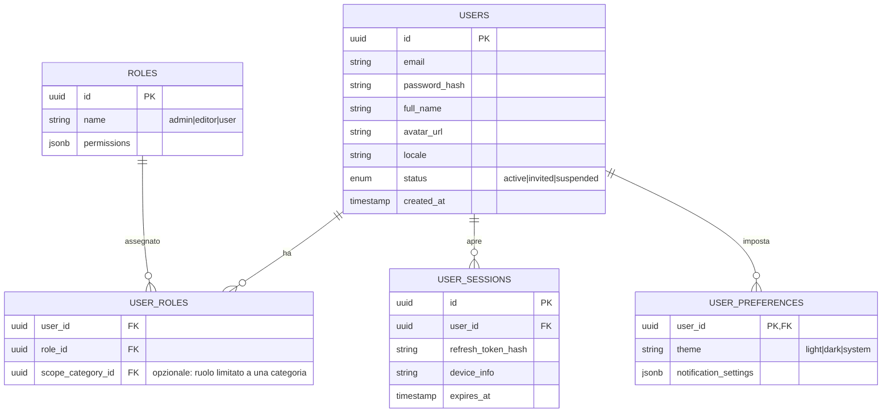
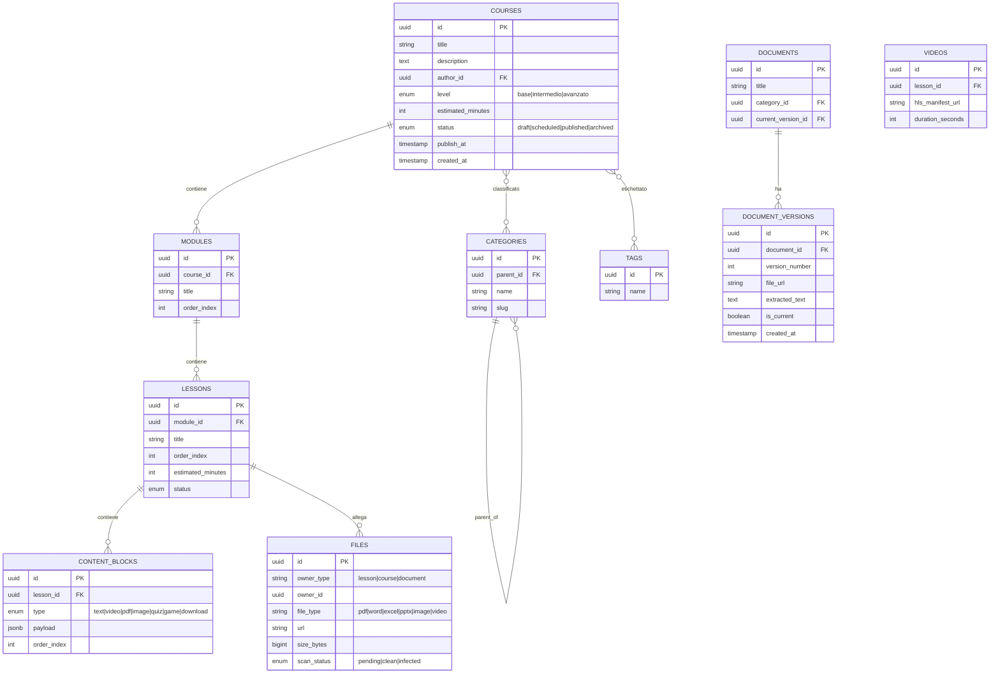
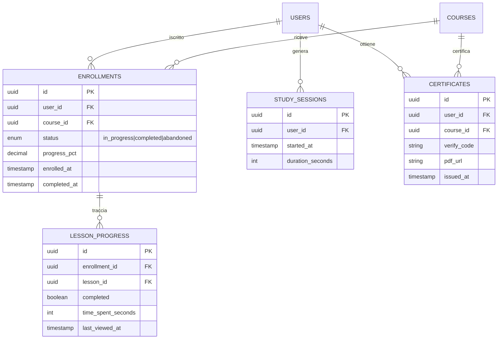
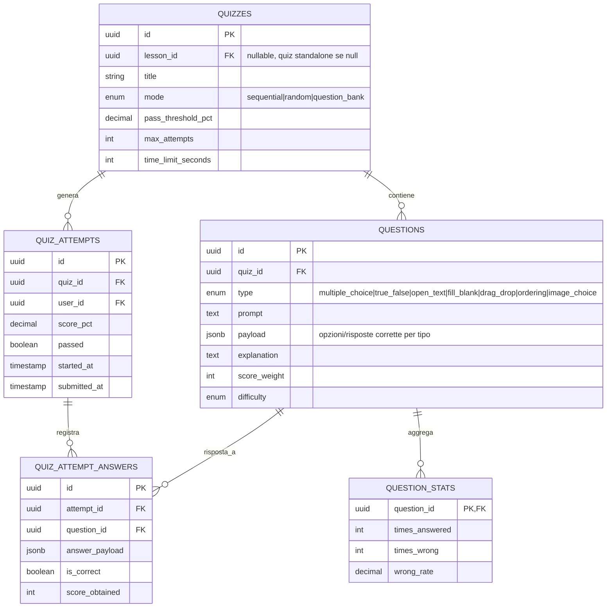
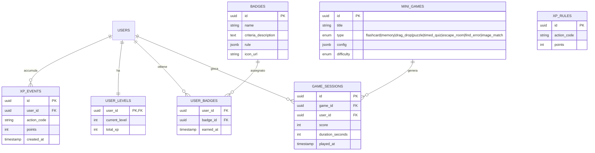
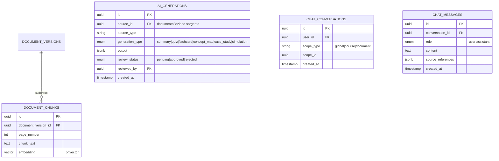

# 10. Modello del database

Schema logico su PostgreSQL, suddiviso per dominio per leggibilità. Le chiavi esterne sono omesse dai nomi campo quando ovvie (es. `course_id` referenzia `courses.id`).

## 10.1 Dominio Utenti & Auth

## 10.2 Dominio Contenuti (CMS)

## 10.3 Dominio Progressi & Iscrizioni

## 10.4 Dominio Quiz

## 10.5 Dominio Gamification

## 10.6 Dominio Intelligenza Artificiale

## 10.7 Note di progettazione

- **UUID** come chiave primaria ovunque: facilita sharding futuro e integrazione multi-tenant senza collisioni.
- **Soft delete** (`deleted_at`) sulle entità di contenuto principali, per non perdere lo storico legato a progressi/certificati già emessi.
- **Tabelle di riepilogo/materialized view** (`daily_usage_stats`, `course_funnel_stats`) separate dalle tabelle transazionali per non appesantire le query analitiche della dashboard admin (cap. 7 e 16).
- **Multi-tenancy** (se la piattaforma sarà venduta a più organizzazioni): aggiungere `organization_id` come colonna di partizionamento su tutte le tabelle principali fin dal disegno iniziale, anche se l'MVP gestisce un solo tenant — evita una migrazione dolorosa in seguito.
