# 11. Sitemap completa

```mermaid
flowchart TD
    A[Home] --> B[Login/Registrazione]
    A --> C[Dashboard utente]
    A --> D[Catalogo corsi]
    A --> E[Categorie]
    A --> F[Manuali]
    A --> G[Video]
    A --> H[Quiz]
    A --> I[Mini giochi]
    A --> J[Area Download]
    A --> K[FAQ]
    A --> L[Assistente IA]
    A --> M[Profilo utente]
    A --> N[Progressi]
    A --> O[Certificati]

    D --> D1[Scheda corso]
    D1 --> D2[Modulo]
    D2 --> D3[Lezione]
    D3 --> D3a[Contenuto testo/video/pdf]
    D3 --> D3b[Quiz di lezione]
    D3 --> D3c[Mini gioco di lezione]

    E --> E1[Sottocategoria] --> D

    F --> F1[Viewer documento]
    F1 --> F2[Storico versioni]

    G --> G1[Player video]

    H --> H1[Player quiz]
    H1 --> H2[Risultato quiz]

    I --> I1[Flashcard]
    I --> I2[Memory]
    I --> I3[Drag & Drop]
    I --> I4[Puzzle]
    I --> I5[Quiz a tempo]
    I --> I6[Escape Room]
    I --> I7[Trova l'errore]
    I --> I8[Abbinamento immagini]
    I --> I9[Classifiche]

    M --> M1[Sicurezza account]
    M --> M2[Preferenze notifiche]

    O --> O1[Verifica pubblica certificato]

    C --> P[Dashboard amministratore]
    P --> P1[Gestione corsi/moduli/lezioni]
    P1 --> P1a[Editor a blocchi]
    P1 --> P1b[Media Library]
    P --> P2[Gestione manuali e versioni]
    P --> P3[Gestione categorie e tag]
    P --> P4[Calendario pubblicazioni]
    P --> P5[Gestione quiz]
    P --> P6[Gestione mini giochi]
    P --> P7[Gestione gamification - badge/XP]
    P --> P8[Gestione FAQ]
    P --> P9[Gestione utenti e ruoli]
    P --> P10[Generatore IA]
    P --> P11[Statistiche e Report]
    P --> P12[Impostazioni piattaforma]
```

## Elenco piatto delle sezioni (per riferimento rapido)

**Area pubblica/autenticata (utente)**
- `/` Home
- `/login`, `/register`, `/forgot-password`
- `/dashboard`
- `/courses` Catalogo corsi → `/courses/:slug` Scheda corso → `/courses/:slug/lessons/:lessonId` Lezione
- `/categories` → `/categories/:slug`
- `/manuals` → `/manuals/:id`
- `/videos` → `/videos/:id`
- `/quizzes` → `/quizzes/:id` → `/quizzes/:id/attempts/:attemptId`
- `/games` → `/games/:id`
- `/downloads`
- `/faq`
- `/assistant` (chat IA)
- `/profile`, `/profile/security`, `/profile/notifications`
- `/progress`
- `/certificates` → `/certificates/verify/:code` (pubblica, no login)

**Area amministrativa**
- `/admin` Dashboard admin
- `/admin/courses` (+ editor)
- `/admin/documents`
- `/admin/categories`, `/admin/tags`
- `/admin/publish-schedule`
- `/admin/quizzes`
- `/admin/games`
- `/admin/gamification` (badge, regole XP)
- `/admin/faq`
- `/admin/users`
- `/admin/ai-generator`
- `/admin/reports`
- `/admin/settings`
