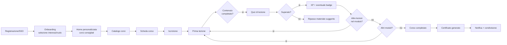
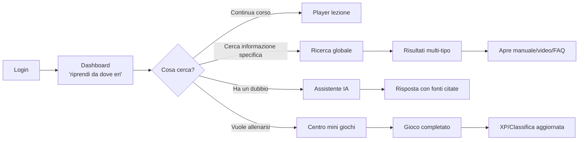
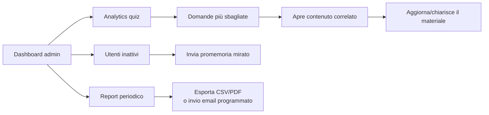

# 12. Flusso di navigazione degli utenti

## 12.1 Journey — Utente nuovo (onboarding e primo corso)

## 12.2 Journey — Utente ricorrente (ricerca e consultazione rapida)

## 12.3 Journey — Amministratore (creazione e pubblicazione contenuto)

```mermaid
flowchart LR
    A[Login admin] --> B[Dashboard admin]
    B --> C[Nuovo corso]
    C --> D[Compila metadati\ncategoria/tag/livello]
    D --> E[Aggiungi moduli e lezioni]
    E --> F[Upload materiali\nPDF/Word/Excel/PPT/video/immagini]
    F --> G[Scan antivirus + elaborazione\nasincrona - transcodifica/estrazione testo]
    G --> H{Vuole generare\ncontenuti con IA?}
    H -- si --> I[Genera quiz/flashcard/riassunto]
    I --> J[Revisione e correzione]
    J --> K[Approvazione]
    H -- no --> K
    K --> L{Pubblica ora\no programma?}
    L -- ora --> M[Pubblicato - visibile utenti]
    L -- programma --> N[In coda pubblicazione]
    N -->|job schedulato| M
    M --> O[Notifica utenti interessati]
```

## 12.4 Journey — Amministratore (monitoraggio e miglioramento continuo)

## 12.5 Considerazioni di navigazione

- **Deep-linking** garantito ovunque (ogni lezione, documento a pagina X, domanda quiz, badge ha un URL diretto condivisibile).
- **Continuità cross-device**: la posizione di avanzamento (video, lezione, quiz in corso) è salvata server-side, non solo in locale, per riprendere da un altro dispositivo.
- **Breadcrumb** sempre coerente con la sitemap (cap. 11) per permettere di risalire senza perdere il contesto.
- **Percorso guidato vs. esplorazione libera**: i corsi possono essere configurati come sequenziali (blocco lezioni successive) o liberi (navigazione libera tra lezioni), a scelta dell'admin in fase di creazione corso.
